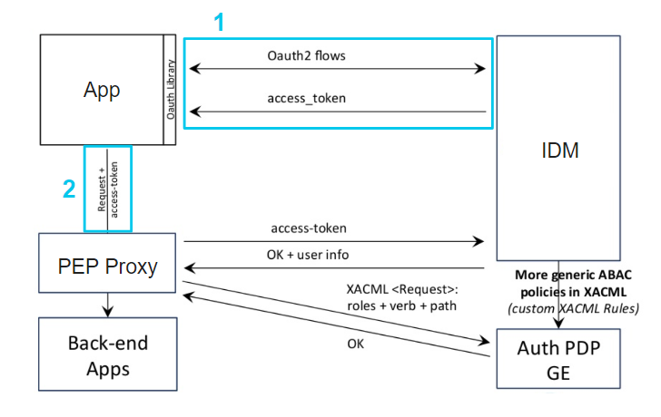
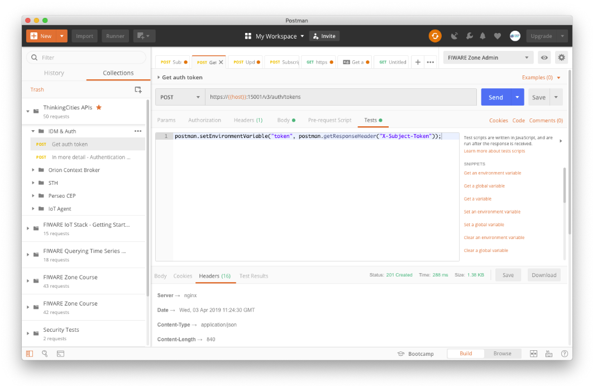

[](http://www.fiware.zone)

# Agentes IoT

[](https://github.com/FIWARE/catalogue/blob/master/core/README.md)
[](https://fiware-ges.github.io/orion/api/v2/stable/)

**Descripción:** En este tutorial vamos a ver los Agentes IoT, piezas que adaptan el protocolo típico de los dispositivos a NGSI para que se almacenen en el Context Broker. En el, se va a repasar:

- Arquitectura
- Aprovisionamiento de dispositivos y grupos de dispositivos
- Envío de medidas y comandos
- Transformación de medidas
- Ejemplos sobre HTTP y MQTT


El tutorial usa comandos [cUrl](https://ec.haxx.se/) en el, pero también está disponible como 
documentación Postman

[](https://app.getpostman.com/run-collection/dfdf957d080a75738ef7)


# Autenticación
En caso de ejecutar las operaciones en modo local, empleando el context broker, no será necesario ningun tipo de autenticación.

En el de usar una plataforma con autenticación, el escenario típico de uso involucra varios elementos:
- **App**: Es la aplicación que accede a los recursos. Esto sería en el caso de este tutorial las peticiones cURL o Postman.
- **Back-end Apps**: Son los recursos protegidos. En este caso, es el Context Broker, pero podría ser cualquier elemento que requiera securización
- **IDM**: Es quien provee identificación a los usuarios
- **PEP**: Es un proxy que permite a la aplicación acceder a los recursos protegidos, por el ejemplo, el context broker
- **PDP**:

En la siguiente imagen podemos ver el esquema de los elemntos :



El proceso para autenticarnos y obtener el dato sería el siguente:

1. Solicitar el token de acceso al **IDM** con los credenciales de usuario
2. Enviar la petición que accede al dato junto con el token obtenido en el paso 1 al **PEP**  como cabecera de las peticiones con el nombre `X-Auth-Token`

## Obtención del token

Para obtener el token necesitamos enviar una petición al IDM para obtener el token. En ella debemos enviar la siguiente petición:

**Petición**

```bash
curl -iX POST 'http://localhost:15001/v3/auth/tokens' \
-H 'Content-Type: application/json' \
-d '
{
    "auth": {
        "identity": {
            "methods": [
                "password"
            ],
            "password": {
                "user": {
                    "domain": {
                        "name": "SERVICE"
                    },
                    "name": "USER",
                    "password": "PASSWORD"
                }
            }
        }
    }
}'
```

En donde hay que sustituir: 
- SERVICE: por el serivicio (Fiware-Service) al que queremos acceder
- USER: El usuario con el que queremos acceder
- PASSWORD: La contraseña del usuario

**Respuesta**

Obtendremos por parte del IDM un código de respuesta 201, siendo la respuesta algo similar a:

```http
HTTP/1.1 201 Created
Server: nginx
Date: Fri, 29 May 2020 10:34:00 GMT
Content-Type: application/json
Content-Length: 549
Connection: keep-alive
X-Subject-Token: 88d70506abb00141b3b36005a779651e
Vary: X-Auth-Token
X-Openstack-Request-Id: req-4f9922f1-5980-4971-a08a-746f1c97c189
X-Frame-Options: SAMEORIGIN
Strict-Transport-Security: max-age=31536000; includeSubdomains;
X-Content-Type-Options: nosniff
Cache-Control: no-cache, no-store, max-age=0, must-revalidate
Pragma: no-cache
Expires: 0
X-XSS-Protection: 1; mode=block
Referrer-Policy: same-origin

{
  "token": {
    "methods": [
      "password"
    ],
    "expires_at": "2020-05-29T13:34:00.917768Z",
    "extras": {
      "password_creation_time": "2019-02-20T11:33:21Z",
      "sndfa_email": false,
      "last_login_attempt_time": "2020-05-29T10:33:42.000000",
      "pwd_user_in_blacklist": false,
      "password_expiration_time": "2029-02-17T11:33:21Z"
    },
    "user": {
      "domain": {
        "id": "350afb322fe448234562728e43602421",
        "name": "SERVICE"
      },
      "id": "3533f385094503da770bab252e1ba31",
      "name": "USER"
    },
    "audit_ids": [
      "xG-DDK85abc12399QhRPw"
    ],
    "issued_at": "2020-05-29T10:34:00.917798Z"
  }
}
```

El token de autenticación que necesitamos se encuentra en la cabecera http `X-Subject-Token`

### Obtención del token mediante Postman

Postman permite definir variables de entorno y ejecutar pequeñas acciones - script - tras realizar la petición. La petición de autenticación guarda el `X-Subject-Token` en la variable `token` que se emplea como valor de la cabecera `X-Auth-Token` definida en las peticiones de la colección.



# Introducción

Un Agente IoT es un componente que permite a un grupo de dispositivos enviar datos y ser administrados desde el Context Broker usando sus propios protocolos nativos. Los Agentes IoT también deben ser capaz de gestionar los aspectos de seguridad de la plataforma FIWARE (autenticación y autorización de los datos) y proveer una serie de servicios comunes a los programadores de los dispositivos.

El Orion Context Boker solo usa peticiones NGSI para sus interacciones. Cada Agente IoT provee una interfaz, el Puerto Norte, de tipo NGSI, la cual es usada para interactuar con el Context Broker, y el Puerto Sur, bajo el cual tienen lugar las interacciones utilizando el protocolo nativo de los dispositivos conectados.

Esto ofrece una interfaz estandar para todas las interacciones con los dispositivos IoT a nivel de gestión de información de contexto. Cada grupo de dispositivos IoT es capaz de usar sus propios protocolos y protocolos distintos de transporte asociado al Agente IoT, el cual encapsula todas estas operaciones para simplificar la operación.

Existen Agentes IoT para muchos de los protocolos IoT de comunicacioón, como por ejemplo:

- IoTAgent-JSON - un adaptador de mensajes HTTP/MQTT con el cuerpo del mensaje en JSON a NGSI
- IoTAgent-LWM2M - un adaptador de mensajes del protocolo Lightweight M2M a NGSI
- IoTAgent-UL - un adaptador de mensajes HTTP/MQTT con el cuerpo del mensaje en Ultralight2.0 a NGSI
- IoTagent-LoRaWAN - un adaptador de mensajes del protocolo LoRaWAN a NGSI

En general, varias las ventajas de los Agentes IoT son:

- Ofrecer un lugar estandarizado para escuchar las actualizaciones de los dispositivos
- Ofrecer un lugar estandarizado para escuchar las actualizaciones de contexto
- Ofrecer una lista de dispositivos y el mapeo de los atributos de los datos de contexto a la sintaxis del dispositivo
- Ofrecer mencanismos de securización - como la autorización.

Todas estas funcionalidades básicas se han implementando en una [libreriía framework común de Agentes IoT](https://iotagent-node-lib.readthedocs.io/en/latest/)

# Operaciones de grupo de servicio

> **Nota**
>
>La arquitectura de la plataforma [Thinking City](https://thinking-cities.readthedocs.io/en/latest/) que se emplea en este curso dispone del componente [IoT Agent Manager](https://github.com/telefonicaid/iotagent-manager), un componente que sirve para administrar múltiples Agentes IoT en una misma interfaz. Es por ello que puede variar la cantidad de parámetros necesarios, con respecto a una arquitectura que no emplee este componente, dado que estos parámetros están especificados en la configuración global del IoT Agent Manager.

Además, al usar el componente [IoT Agent Manager](https://github.com/telefonicaid/iotagent-manager) sólo vamos a tener un punto de administración de los IoT Agents, por lo que el hostname y el puerto al hacer la petición siempre va a ser el mismo. En este ejemplo vamos a suponer que se corre en `localhost` , en el puerto `4041`.

Los grupos de servicio - también llamados grupos de provisionamiento - se establecen para agrupar a todos los dispositivos que tienen características similares para un mismo Agente IoT. En el grupo de provisionammiento se especifican, entre otros:

- Apikey: Clave común para todo el grupo de servicio o provisionamiento necesaria para que los datos se guarden en el Agente IoT. Con ella va univocamente identificada las cabeceras `FIWARE-Service` y `FIWARE-Servicepath`.
- Tipo de entidad: Especifica el tipo de entidad en el que se guardan los datos procedentes de los dispositivos. Si no hay creado un dispositivo, por defecto se creará (autoprovisionará) una entidad de este tipo.
- Protocolo: Es el protocolo de datos (por ejemplo, Ultralight 2.0) del grupo de provisión que estamos especificando.


## Creación de Grupo de servicio o de provisionamiento

La creacion de grupo de un grupo de servicio o provisionamiento es siempre el primer paso para conectar dispositivos. En el, creamos el `apikey` que autorizará a los dispositivos a enviar datos a la plataforma. Es posible, en este paso, definir los atributos y comandos para todos los dispositivos del grupo, pero esto se hará en la fase de provisionamiento de los dispositivos.

En el siguiente ejemplo vamos a provisionar un grupo de servicio con la apikey con el valor `apikeyul` y protocolo Ultralight 2.0 `IoTA-UL`

### Petición

```bash
curl -iX POST 'http://localhost:4041/iot/services' \
  -H 'Content-Type: application/json' \
  -H 'fiware-service: servicio' \
  -H 'fiware-servicepath: /subservicio' \
-d '
{
  "services": [
    {
      "apikey": "apikeyul",
      "entity_type": "device",
      "protocol": [ "IoTA-UL" ]
    }
  ]
}'
```

## Listar los grupos de servicios

Para listar todos los grupos de servicio del IoT Agent en dicho subservicio (service path) tenemos que hacer un `GET` a la misma ruta donde hemos creado el serivicio.

### Petición

```bash
curl -X GET 'http://localhost:4041/iot/services' \
  -H 'fiware-service: servicio' \
  -H 'fiware-servicepath: /subservicio'
```

## Actualizar un grupo de servicio

En caso de querer modificar la información de un grupo de servicio en concreto, hay que identificarlo por 2 parámetros, el recurso o `resource` y el `apikey`. El primero está relacionado con el recurso donde está configurado el agente IoT. En el caso de la plataforma que usamos, es:

- Para Agente IoT Ultralight 2.0: `/iot/d`
- Para Agente JSON: `/iot/json`

El segundo parámetro, el del `apikey`, corresponde al que se facilitó cuando se creo el grupo de provisionamiento, en nuestro caso, `apikeyul`. Para modificar un grupo de servicio hay que proveer estos dos datos en la URL de la siguiente manera.

### Petición

```bash
curl -iX PUT 'http://localhost:4041/iot/services?resource=/iot/d&apikey=apikeyul' \
  -H 'Content-Type: application/json' \
  -H 'fiware-service: servicio' \
  -H 'fiware-servicepath: /subservicio' \
-d '
{
  "entity_type": "IoT-Device"
}'
```

## Borrar un grupo de servicio

Para borrar un grupo de servicio, necesitamos identificarlo, por lo que no será necesario proveer de los parámetros `apikey` y `resource` en la URL de la petición.

### Petición

```bash
curl -X DELETE 'http://localhost:4041/iot/services?resource=/iot/d&apikey=apikeyul' \
  -H 'fiware-service: servicio' \
  -H 'fiware-servicepath: /subservicio'
```

# Provisionando dispositivos

Cuando provisionamos un dispositivo, estamos creando una relación entre los datos del dispositivo que entrar por el **Agente IoT** y la entidad almacenada en el **Context Broker**.

## Creación de dispositivo

>
> **Nota**: En caso de que no sea necesario provisionar un `id` especifico, y los datos de los atributos en la provision del grupo de serivicio sean suficientes, no es necesario provisionar el dispositivo, ya que el Agente IoT, cuando reciba un dato de un nuevo dispositivo, lo autoprovisionará creandolo con el identificador recibido y asociandolo a la endidad con el siguiguiente patrón: `<tipo_entidad>:<id_dispositivo>`. En caso que dicha entidad no exista, se creará de forma automática.
>

### Petición

```bash
curl -iX POST 'http://localhost:4041/iot/services' \
  -H 'Content-Type: application/json' \
  -H 'fiware-service: servicio' \
  -H 'fiware-servicepath: /subservicio' \
-d '
{
  "devices": [
    {
      "device_id": "tracker-1",
      "entity_name": "Vehicle:Car1",
      "entity_type": "Vehicle",
      "protocol": "IoTA-UL",
      "transport": "HTTP",
      "attributes": [ 
            { "object_id": "s", "name": "speed", "type": "Number" },
            { "object_id": "r", "name": "rpm", "type": "Number" }
      ],
      "commands": [ 
        { "name": "cmd", "type": "command" }
       ],
       "static_attributes": [
         {"name":"refDevice", "type": "Relationship","value": "urn:ngsi-ld:Tracker:001"}
    	]
    }
  ]
}'
```

Con esta petición hemos creado un dispositivo con el identificador `tracker-1` que emplea el protocolo `IoTA-UL`, es decir, ultralight 2.0, sobre el transporte `HTTP` y que escribirá en la entidad `Vehicle:Car1` con los parámetros `s` y `r` que se escribirán en los atributos `speed` y `rpm` respectivamente, el atributo estático `refDevice` y con el comando `cmd`.

## Listar todos los dispositivos

Para listar todos los dispositivos hay que hacer una petición `GET` a la ruta `/iot/devices?protocol=PROTOCOLO` donde el protocolo puede ser `IoTA-UL` para Ultralight y `IoTA-JSON` para JSON, dado que tenemos que indicarle al IoT Agent Manager a que Agente debe hacerle la consulta.

### Petición

```bash
curl -X GET 'http://localhost:4041/iot/devices?protocol=IoTA-UL' \
  -H 'fiware-service: servicio' \
  -H 'fiware-servicepath: /subservicio'
```


## Leer la información de un dispositivo

Para leer la información de un dispositivo hay que hacer una petición `GET` a la ruta `/iot/devices/<deviceid>?protocol=PROTOCOLO` donde el protocolo puede ser `IoTA-UL` para Ultralight y `IoTA-JSON` para JSON, y `<deviceid>` el identificador del dispositivo.

### Petición

```bash
curl -X GET 'http://localhost:4041/iot/devices/tracker-1?protocol=IoTA-UL' \
  -H 'fiware-service: servicio' \
  -H 'fiware-servicepath: /subservicio'
```

## Actualizar un dispositivo

Para leer la información de un dispositivo hay que hacer una petición `PUT` a la ruta `/iot/devices/<deviceid>?protocol=PROTOCOLO` donde el protocolo puede ser `IoTA-UL` para Ultralight y `IoTA-JSON` para JSON, y `<deviceid>` el identificador del dispositivo.

### Petición

```bash
curl -iX POST 'http://localhost:4041/iot/devices/tracker-1?protocol=IoTA-UL' \
  -H 'Content-Type: application/json' \
  -H 'fiware-service: servicio' \
  -H 'fiware-servicepath: /subservicio' \
-d '
{
  "entity_name": "Vehicle:Car2"
}'
```

## Borrar un dispositivo

Para borrar un dispositivo hay que hacer una petición `DELETE` a la ruta `/iot/devices/<deviceid>?protocol=PROTOCOLO` donde el protocolo puede ser `IoTA-UL` para Ultralight y `IoTA-JSON` para JSON, y `<deviceid>` el identificador del dispositivo.

### Petición

```bash
curl -X DELETE 'http://localhost:4041/iot/devices/tracker-1?protocol=IoTA-UL' \
  -H 'fiware-service: servicio' \
  -H 'fiware-servicepath: /subservicio'
```

# Enviando datos y comandos por UL 2.0 sobre HTTP

En este apartado vamos a interactuar con un dispositivo ficticio empleando el protocolo Ultralight 2.0 sobre transporte HTTP.

## Crear grupo de provisionamiento

Lo primiero que debemos hacer, si no lo hemos hecho ya en las peticiones anteriores es crear el grupo de provisionamiento. En caso que lo hayamos creado previamente deberemos saltarnos este paso.

### Petición

```bash
curl -iX POST 'http://localhost:4041/iot/services' \
  -H 'Content-Type: application/json' \
  -H 'fiware-service: servicio' \
  -H 'fiware-servicepath: /subservicio' \
-d '
{
  "services": [
    {
      "apikey": "apikeyul",
      "entity_type": "device",
      "protocol": [ "IoTA-UL" ]
    }
  ]
}'
```

## Crear del dispositivo

Vamos a crear un dispositivo llamado `tracker-10` que escriba la información en la entidad `Vehicle:Car10`, que emplea el protocolo `IoTA-UL`, es decir, ultralight 2.0, sobre el transporte `HTTP`, con los parámetros `s` y `r` que se escribirán en los atributos `speed` y `rpm` respectivamente, el atributo estático `refDevice` y con el comando `cmd`.


### Petición

```bash
curl -iX POST 'http://localhost:4041/iot/services' \
  -H 'Content-Type: application/json' \
  -H 'fiware-service: servicio' \
  -H 'fiware-servicepath: /subservicio' \
-d '
{
  "devices": [
    {
      "device_id": "tracker-10",
      "entity_name": "Vehicle:Car10",
      "entity_type": "Vehicle",
      "protocol": "IoTA-UL",
      "transport": "HTTP",
      "attributes": [ 
            { "object_id": "s", "name": "speed", "type": "Number" },
            { "object_id": "r", "name": "rpm", "type": "Number" }
      ],
      "commands": [ 
        { "name": "cmd", "type": "command" }
       ],
       "static_attributes": [
         {"name":"refDevice", "type": "Relationship","value": "urn:ngsi-ld:Tracker:001"}
    	]
    }
  ]
}'
```

## Envío de una medida desde el dispositivo

Para este tutorial, vamos a simular la petición que haría un dispositivo para enviar un comando. En este caso, el dispositivo debe ser capaz de realizar peticiones HTTP al Agente IoT para el envio de datos.

Para enviar un dato por UL 2.0 es necesario hacer una petición a la siguiente ruta:

`POST <HOST>/iot/d?k=<APIKEY>&<DEVICE_ID>`

Donde:

- Host: Es el host donde está hospedado el Agente IoT
- Apikey: Es el apikey que hemos especificado al crear el grupo de servicio
- Device_ID: es el identificador de dispositivo especificado al provisionar el dispositivo (o el que tendrá cuando se autoprovisione)

### Petición

```bash
curl -iX POST 'http://localhost:4040/iot/d?k=apikeyul&i=tracker-10' \
  -H 'Content-Type: text/plain' \
-d 's|115#r|3000'
```

Con esta petición enviamos las medidas de velocidad al valor 115 y RMP a 3000.

## Comprobar que el valor se ha actualizado

Para ver que el valor se ha reflejado en el Context Broker, consultamos la entidad realizando la siguiente operación.

### Petición

```bash
curl -X GET 'http://localhost:1026/v2/entities/Vehicle:Car10' \
  -H 'fiware-service: servicio' \
  -H 'fiware-servicepath: /subservicio'
```

Deberemos ver en la respuesta que los atributos `speed` y `rpm` tienen el valor a 115 y 3000 respectivamente, junto con el metadato `TimeInstant` con la fecha y hora en la que se hizo el envío de estos atributos.

## Envío de comando

Para el envío de un comando deberemos haberlo provisionado en el apartado `commands ` al registrar el dispositivo. En este caso, el dispositov `tracker-10` dispone de un comando, `cmd`. Al crear un comando, además se crean 3 atributos. Para un comando llamado `cmd` tendríamos:
- `cmd`: Es el atributo del comando, donde escribimos lo que queremos enviar al dispositov
- `cmd_info`: Lo que el dispositivo nos devuelve tras la ejecución del comando
- `cmd_status`: El estado en el que se encuentra el comando (Desconocido, Pendiente de entrega, entregado, ejecutado etc.)

Para enviar un comando debemos escribir el atributo del comando, en este caso, `cmd` con el valor que le queremos enviar al dispositivo. Debemos asegurarnos que el tipo de atributo siempre sea `command`. 

### Petición

Para enviarle una orden simple podemos recurrir a la siguiente petición

```bash
curl -iX PUT 'http://localhost:1026/v2/entities/Vehicle:Car10/attrs/cmd?type=Vehicle' \
  -H 'Content-Type: application/json' \
  -H 'fiware-service: servicio' \
  -H 'fiware-servicepath: /subservicio' \
-d '
{
  "value": "Close Door",
  "type": "command"
}'
```

En cambio, si queremos enviarle más de un parámetro, podemos escribir value como atributo estructurado, quedando el cuerpo de la petición como se indica a continuación:

```JSON
{
  "value": { "param1": "val1", "param2": "val2" },
  "type": "command"
}
```

Tras ejecutar esta petición el valor del atributo `cmd_status` pasará a ser `PENDING`


## Lectura del comando desde el dispositivo

El dispositivo debe ejecutar la siguiente petición para poder leer el mensaje. En este caso, que el transporte es HTTP, se realiza de forma asíncrona ( a no ser que el dispositivo sea capaz de correr un servidor http, con una ip propia en la que el Agente IoT pueda escribir comandos, pero este no es el escenario común de los dispositivos IoT)

Para ello debe ejecutar periodicamente la siguiente petición:

### Petición

```bash
curl -X GET 'http://localhost:4040/iot/d?k=apikeyul&i=tracker-10&getCmd=1' \
```

También existe la opción de pedirle al Agente IoT que nos devuelva el comando, si hay alguno disponible, cada vez que hacemos un envío, añadiendole el parámetro `getCmd=1` cada vez que escribirmos el valor de un atributo, quedando la petición de la siguiente manera:

```bash
curl -iX POST 'http://localhost:4040/iot/d?k=apikeyul&i=tracker-10&getCmd=1' \
  -H 'Content-Type: text/plain' \
-d 's|135#r|3300'
```
### Respuesta

Tras hacer cualquiera de estas dos peticiones, el servidor nos devolvería el dato con el siguiente formato (siempre y cuando hayamos escrito el atributo comando previamente)

``` 
tracker-10@cmd|Close Door
```
Tras ser leido el comando por parte del dispositivo, el atributo  `cmd_status` cambiará el valor de `PENDING` a `DELIVERED`

## Confirmación de ejecución del comando desde el dispositivo

Tras leer el comando, el dispositivo debería ejecutar una orden y devolver información al Agente IoT. Es por ello que el dispositivo debe realizar una acción más para completar el comando. Debe hacer un `POST` a la misma ruta que emplearía para enviar un dato, con el siguiente formato:

```
<DEVICE_ID>@<CMD_NAME>|<DATA>
```

### Petición

```bash
curl -iX POST 'http://localhost:4040/iot/d?k=apikeyul&i=tracker-10' \
  -H 'Content-Type: text/plain' \
-d 'tracker-10@cmd|cmd OK'
```

Al ejecutar esta petición ocurren 2 cambios
- El atributo `cmd_status` cambia su valor de `DELIVERED` a `OK`
- El atributo `cmd_status` cambia su valor al dato enviado como respuesta del comando, en este caso tomando el valor `cmd OK`

# Enviando datos y comandos por JSON sobre HTTP

En este apartado vamos a interactuar con un dispositivo ficticio empleando el protocolo JSON sobre transporte HTTP.

## Crear grupo de provisionamiento

Lo primiero que debemos hacer, si no lo hemos hecho ya en las peticiones anteriores es crear el grupo de provisionamiento. En caso que lo hayamos creado previamente deberemos saltarnos este paso.

### Petición

```bash
curl -iX POST 'http://localhost:4041/iot/services' \
  -H 'Content-Type: application/json' \
  -H 'fiware-service: servicio' \
  -H 'fiware-servicepath: /subservicio' \
-d '
{
  "services": [
    {
      "apikey": "apikeyjson",
      "entity_type": "device",
      "protocol": [ "IoTA-JSON" ]
    }
  ]
}'
```

## Crear del dispositivo

Vamos a crear un dispositivo llamado `tracker-20` que escriba la información en la entidad `Vehicle:Car20`, que emplea el protocolo `IoTA-JSON`, es decir, JSON, sobre el transporte `HTTP`, con los parámetros `s` y `r` que se escribirán en los atributos `speed` y `rpm` respectivamente, el atributo estático `refDevice` y con el comando `cmd`.


### Petición

```bash
curl -iX POST 'http://localhost:4041/iot/services' \
  -H 'Content-Type: application/json' \
  -H 'fiware-service: servicio' \
  -H 'fiware-servicepath: /subservicio' \
-d '
{
  "devices": [
    {
      "device_id": "tracker-20",
      "entity_name": "Vehicle:Car20",
      "entity_type": "Vehicle",
      "protocol": "IoTA-JSON",
      "transport": "HTTP",
      "attributes": [ 
            { "object_id": "s", "name": "speed", "type": "Number" },
            { "object_id": "r", "name": "rpm", "type": "Number" }
      ],
      "commands": [ 
        { "name": "cmd", "type": "command" }
       ],
       "static_attributes": [
         {"name":"refDevice", "type": "Relationship","value": "urn:ngsi-ld:Tracker:001"}
    	]
    }
  ]
}'
```

## Envío de una medida desde el dispositivo

Para este tutorial, vamos a simular la petición que haría un dispositivo para enviar un comando. En este caso, el dispositivo debe ser capaz de realizar peticiones HTTP al Agente IoT para el envio de datos.

Para enviar un dato por UL 2.0 es necesario hacer una petición a la siguiente ruta:

`POST <HOST>/iot/json?k=<APIKEY>&<DEVICE_ID>`

Donde:

- Host: Es el host donde está hospedado el Agente IoT
- Apikey: Es el apikey que hemos especificado al crear el grupo de servicio
- Device_ID: es el identificador de dispositivo especificado al provisionar el dispositivo (o el que tendrá cuando se autoprovisione)

### Petición

```bash
curl -iX POST 'http://localhost:4040/iot/?k=apikeyjson&i=tracker-20' \
  -H 'Content-Type: application/json' \
-d '{	"s": 95,  "r": 3150 }'
```

Con esta petición enviamos las medidas de velocidad al valor 115 y RMP a 3000.

## Comprobar que el valor se ha actualizado

Para ver que el valor se ha reflejado en el Context Broker, consultamos la entidad realizando la siguiente operación.

### Petición

```bash
curl -X GET 'http://localhost:1026/v2/entities/Vehicle:Car20' \
  -H 'fiware-service: servicio' \
  -H 'fiware-servicepath: /subservicio'
```

Deberemos ver en la respuesta que los atributos `speed` y `rpm` tienen el valor a 115 y 3000 respectivamente, junto con el metadato `TimeInstant` con la fecha y hora en la que se hizo el envío de estos atributos.

## Envío de comando

Para el envío de un comando deberemos haberlo provisionado en el apartado `commands ` al registrar el dispositivo. En este caso, el dispositov `tracker-20` dispone de un comando, `cmd`. Al crear un comando, además se crean 3 atributos. Para un comando llamado `cmd` tendríamos:
- `cmd`: Es el atributo del comando, donde escribimos lo que queremos enviar al dispositov
- `cmd_info`: Lo que el dispositivo nos devuelve tras la ejecución del comando
- `cmd_status`: El estado en el que se encuentra el comando (Desconocido, Pendiente de entrega, entregado, ejecutado etc.)

Para enviar un comando debemos escribir el atributo del comando, en este caso, `cmd` con el valor que le queremos enviar al dispositivo. Debemos asegurarnos que el tipo de atributo siempre sea `command`. 

### Petición

Para enviarle una orden simple podemos recurrir a la siguiente petición

```bash
curl -iX PUT 'http://localhost:1026/v2/entities/Vehicle:Car20/attrs/cmd?type=Vehicle' \
  -H 'Content-Type: application/json' \
  -H 'fiware-service: servicio' \
  -H 'fiware-servicepath: /subservicio' \
-d '
{
  "value": "Close Door",
  "type": "command"
}'
```

En cambio, si queremos enviarle más de un parámetro, podemos escribir value como atributo estructurado, quedando el cuerpo de la petición como se indica a continuación:

```JSON
{
  "value": { "param1": "val1", "param2": "val2" },
  "type": "command"
}
```

Tras ejecutar esta petición el valor del atributo `cmd_status` pasará a ser `PENDING`


## Lectura del comando desde el dispositivo

El dispositivo debe ejecutar la siguiente petición para poder leer el mensaje. En este caso, que el transporte es HTTP, se realiza de forma asíncrona ( a no ser que el dispositivo sea capaz de correr un servidor http, con una ip propia en la que el Agente IoT pueda escribir comandos, pero este no es el escenario común de los dispositivos IoT)

Para ello debe ejecutar periodicamente la siguiente petición:

### Petición

```bash
curl -X GET 'http://localhost:4040/iot/json?k=apikeyjson&i=tracker-20&getCmd=1' \
```

### Respuesta

Tras hacer cualquiera de estas dos peticiones, el servidor nos devolvería el dato con el siguiente formato (siempre y cuando hayamos escrito el atributo comando previamente)

``` JSON
{"cmd":"Close Door"}
```
Tras ser leido el comando por parte del dispositivo, el atributo  `cmd_status` cambiará el valor de `PENDING` a `DELIVERED`

## Confirmación de ejecución del comando desde el dispositivo

Tras leer el comando, el dispositivo debería ejecutar una orden y devolver información al Agente IoT. Es por ello que el dispositivo debe realizar una acción más para completar el comando. Debe hacer un `POST` a `/iot/json/commands` para compleatrlo.

### Petición

```bash
curl -iX POST 'http://localhost:4040/iot/json/commands?k=apikeyjson&i=tracker-20' \
  -H 'Content-Type: application/json' \
-d '{ "cmd": "cmd OK"}'
```

Al ejecutar esta petición ocurren 2 cambios
- El atributo `cmd_status` cambia su valor de `DELIVERED` a `OK`
- El atributo `cmd_status` cambia su valor al dato enviado como respuesta del comando, en este caso tomando el valor `cmd OK`

# Enviando datos y comandos por UL 2.0 sobre MQTT

En este apartado vamos a interactuar con un dispositivo ficticio empleando el protocolo Ultralight 2.0 sobre transporte MQTT.

## Crear grupo de provisionamiento

Lo primiero que debemos hacer, si no lo hemos hecho ya en las peticiones anteriores es crear el grupo de provisionamiento. En caso que lo hayamos creado previamente deberemos saltarnos este paso.

### Petición

```bash
curl -iX POST 'http://localhost:4041/iot/services' \
  -H 'Content-Type: application/json' \
  -H 'fiware-service: servicio' \
  -H 'fiware-servicepath: /subservicio' \
-d '
{
  "services": [
    {
      "apikey": "apikeyul",
      "entity_type": "device",
      "protocol": [ "IoTA-UL" ]
    }
  ]
}'
```

## Crear del dispositivo

Vamos a crear un dispositivo llamado `tracker-30` que escriba la información en la entidad `Vehicle:Car30`, que emplea el protocolo `IoTA-UL`, es decir, ultralight 2.0, sobre el transporte `MQTT`, con los parámetros `s` y `r` que se escribirán en los atributos `speed` y `rpm` respectivamente, el atributo estático `refDevice` y con el comando `cmd`.


### Petición

```bash
curl -iX POST 'http://localhost:4041/iot/services' \
  -H 'Content-Type: application/json' \
  -H 'fiware-service: servicio' \
  -H 'fiware-servicepath: /subservicio' \
-d '
{
  "devices": [
    {
      "device_id": "tracker-30",
      "entity_name": "Vehicle:Car30",
      "entity_type": "Vehicle",
      "protocol": "IoTA-UL",
      "transport": "MQTT",
      "attributes": [ 
            { "object_id": "s", "name": "speed", "type": "Number" },
            { "object_id": "r", "name": "rpm", "type": "Number" }
      ],
      "commands": [ 
        { "name": "cmd", "type": "command" }
       ],
       "static_attributes": [
         {"name":"refDevice", "type": "Relationship","value": "urn:ngsi-ld:Tracker:001"}
    	]
    }
  ]
}'
```

## Envío de una medida desde el dispositivo

Para este tutorial, vamos a simular la acción que haría un dispositivo para enviar un comando. En este caso, el dispositivo debe ser capaz de publicar en un broker MQTT para realizar el envío de datos

Para enviar un dato por UL 2.0 sobre MQTT es necesario publicar en el topic con el siguiente formato:

```
/<APIKEY>/<DEVICE_ID>/attrs
```

Donde:

- Apikey: Es el apikey que hemos especificado al crear el grupo de servicio
- Device_ID: es el identificador de dispositivo especificado al provisionar el dispositivo (o el que tendrá cuando se autoprovisione)

### Comando

Para simular el envío ejecutaremos el comando `mosquitto_pub`, teniendo el cliente `mosquitto-clients` previamente instalado, o cualquier otro método para interactuar con un broker mqtt

```bash
mosquitto_pub -h "localhost" -t "/apikeyul/tracker-30/attrs" -m "s|115#r|3000"
```

Donde:

- El valor del parámetro -h indica el servidor donde está corriendo el broker.
- El valor del parámetro -t indica el topic en el que queremos publicar.
- El valor del parámetro -m define el mensaje, en este caso, en sintaxis Ultralight.

Con este comando enviamos las medidas de velocidad al valor 115 y RMP a 3000.

## Comprobar que el valor se ha actualizado

Para ver que el valor se ha reflejado en el Context Broker, consultamos la entidad realizando la siguiente operación.

### Petición

```bash
curl -X GET 'http://localhost:1026/v2/entities/Vehicle:Car30' \
  -H 'fiware-service: servicio' \
  -H 'fiware-servicepath: /subservicio'
```

Deberemos ver en la respuesta que los atributos `speed` y `rpm` tienen el valor a 115 y 3000 respectivamente, junto con el metadato `TimeInstant` con la fecha y hora en la que se hizo el envío de estos atributos.

## Lectura del comando desde el dispositivo

Para que el dispositivo sea capaz de leer la información, ha de estar suscrito a un topic en el que recibirá los comandos. A diferencia del método de transporte HTTP que hemos visto previamente, esto es un mecanísmo asíncrono, lo que hace que el dato llegue de forma instantánea al dispositivo, sin tener que esperar que este esté comprobándo de forma peródica. En este caso, para ser capaces de leer el dato enviado desde la plataforma, es necesario que hagamos este paso - suscribirmos - antes del envío del dato. Para ello, tenemos que hacer que el dispositivo se quede escuchando dicho topic mediante el siguiente comando:

### Comando

Para simular la recepción del dato por parte del dispositivo ejecutaremos el comando `mosquitto_pub`, teniendo el cliente `mosquitto-clients` previamente instalado, o cualquier otro método para interactuar con un broker mqtt. Esto nos permitirá estar suscrito al topic y leer todos los mensajes que se publiquen en el.

```bash
mosquitto_sub -h "localhost" -t "/apikeyul/tracker-30/cmd"
```

Donde:

- El valor del parámetro -h indica el servidor donde está corriendo el broker.
- El valor del parámetro -t indica el topic en el que queremos suscribirnos.

Para parar de escuchar tenemos que pulsar ctrl+c

## Envío de comando

Para el envío de un comando deberemos haberlo provisionado en el apartado `commands ` al registrar el dispositivo. En este caso, el dispositov `tracker-30` dispone de un comando, `cmd`. Al crear un comando, además se crean 3 atributos. Para un comando llamado `cmd` tendríamos:
- `cmd`: Es el atributo del comando, donde escribimos lo que queremos enviar al dispositov
- `cmd_info`: Lo que el dispositivo nos devuelve tras la ejecución del comando
- `cmd_status`: El estado en el que se encuentra el comando (Desconocido, Pendiente de entrega, entregado, ejecutado etc.)

Para enviar un comando debemos escribir el atributo del comando, en este caso, `cmd` con el valor que le queremos enviar al dispositivo. Debemos asegurarnos que el tipo de atributo siempre sea `command`. 

### Petición

Para enviarle una orden simple podemos recurrir a la siguiente petición

```bash
curl -iX PUT 'http://localhost:1026/v2/entities/Vehicle:Car30/attrs/cmd?type=Vehicle' \
  -H 'Content-Type: application/json' \
  -H 'fiware-service: servicio' \
  -H 'fiware-servicepath: /subservicio' \
-d '
{
  "value": "Close Door",
  "type": "command"
}'
```

En cambio, si queremos enviarle más de un parámetro, podemos escribir value como atributo estructurado, quedando el cuerpo de la petición como se indica a continuación:

```JSON
{
  "value": { "param1": "val1", "param2": "val2" },
  "type": "command"
}
```

Tras ejecutar esta petición el valor del atributo `cmd_status` pasará a ser `PENDING`.

### Recepción del mensaje en el dispositivo

Tras hacer la petición de envío en el context broker, deberemos recibir el dato la ventana de terminal en la que estamos suscritos. Tendríamos que ver algo similar a lo siguiente

```  BASH
mosquitto_sub -h "localhost" -t "/apikeyul/tracker-30/cmd"
mqtt-tracker-30@cmd|Close Door
```
En este caso, al ser asíncrono y no disponer de un método para saber si el dispositivo ha leido el dato, el valor de `cmd_status` permanecerá a `PENDING`

## Confirmación de ejecución del comando desde el dispositivo

Tras leer el comando, el dispositivo debería ejecutar una orden y devolver información al Agente IoT. Es por ello que el dispositivo debe realizar una acción más para completar el comando. Debe publicar en la ruta con el siguiente formato:

```
/<APIKEY>/<DEVICE_ID>/cmdexe
```

El mensaje tendrá el formato identico a la petición HTTP

### Comando

Para realizar la confirmación del mensaje vamos a publicar un mensaje en el broker mediante el comando mosquito_pub

```bash
mosquitto_pub -h "localhost" -t "/apikeyul/tracker-30/cmdexe" -m "mqtt-tracker-30@cmd|cmd OK"
```

Al ejecutar esta petición ocurren 2 cambios
- El atributo `cmd_status` cambia su valor de `PENDING` a `OK`
- El atributo `cmd_status` cambia su valor al dato enviado como respuesta del comando, en este caso tomando el valor `cmd OK`


# Enviando datos y comandos por JSON sobre MQTT

En este apartado vamos a interactuar con un dispositivo ficticio empleando el protocolo JSON sobre transporte MQTT.

## Crear grupo de provisionamiento

Lo primiero que debemos hacer, si no lo hemos hecho ya en las peticiones anteriores es crear el grupo de provisionamiento. En caso que lo hayamos creado previamente deberemos saltarnos este paso.

### Petición

```bash
curl -iX POST 'http://localhost:4041/iot/services' \
  -H 'Content-Type: application/json' \
  -H 'fiware-service: servicio' \
  -H 'fiware-servicepath: /subservicio' \
-d '
{
  "services": [
    {
      "apikey": "apikeyjson",
      "entity_type": "device",
      "protocol": [ "IoTA-JSON" ]
    }
  ]
}'
```

## Crear del dispositivo

Vamos a crear un dispositivo llamado `tracker-40` que escriba la información en la entidad `Vehicle:Car40`, que emplea el protocolo `IoTA-JSON`, es decir, JSON, sobre el transporte `MQTT`, con los parámetros `s` y `r` que se escribirán en los atributos `speed` y `rpm` respectivamente, el atributo estático `refDevice` y con el comando `cmd`.


### Petición

```bash
curl -iX POST 'http://localhost:4041/iot/services' \
  -H 'Content-Type: application/json' \
  -H 'fiware-service: servicio' \
  -H 'fiware-servicepath: /subservicio' \
-d '
{
  "devices": [
    {
      "device_id": "tracker-40",
      "entity_name": "Vehicle:Car40",
      "entity_type": "Vehicle",
      "protocol": "IoTA-JSON",
      "transport": "MQTT",
      "attributes": [ 
            { "object_id": "s", "name": "speed", "type": "Number" },
            { "object_id": "r", "name": "rpm", "type": "Number" }
      ],
      "commands": [ 
        { "name": "cmd", "type": "command" }
       ],
       "static_attributes": [
         {"name":"refDevice", "type": "Relationship","value": "urn:ngsi-ld:Tracker:001"}
    	]
    }
  ]
}'
```

## Envío de una medida desde el dispositivo

Para este tutorial, vamos a simular la acción que haría un dispositivo para enviar un comando. En este caso, el dispositivo debe ser capaz de publicar en un broker MQTT para realizar el envío de datos

Para enviar un dato por JSON sobre MQTT es necesario publicar en el topic con el siguiente formato:

```
/json/<APIKEY>/<DEVICE_ID>/attrs
```

Donde:

- Apikey: Es el apikey que hemos especificado al crear el grupo de servicio
- Device_ID: es el identificador de dispositivo especificado al provisionar el dispositivo (o el que tendrá cuando se autoprovisione)

Como podemos ver, es el mismo que para UltraLight pero precedido del prefijo /json.

### Comando

Para simular el envío ejecutaremos el comando `mosquitto_pub`, teniendo el cliente `mosquitto-clients` previamente instalado, o cualquier otro método para interactuar con un broker mqtt

```bash
mosquitto_pub -h "localhost" -t "/json/apikeyul/tracker-40/attrs" -m "{ \"s\":95, \"r\":3150}"
```

En este caso hemos tenido que añadir el caracter `\` previo a cada `"` dentro del mensaje para evitar que el bash cerrara el mensaje. Esto no sería necesario si usamos un cliente MQTT


Donde:

- El valor del parámetro -h indica el servidor donde está corriendo el broker.
- El valor del parámetro -t indica el topic en el que queremos publicar.
- El valor del parámetro -m define el mensaje, en este caso, en sintaxis Ultralight.

Con este comando enviamos las medidas de velocidad al valor 95 y RMP a 3150.

## Comprobar que el valor se ha actualizado

Para ver que el valor se ha reflejado en el Context Broker, consultamos la entidad realizando la siguiente operación.

### Petición

```bash
curl -X GET 'http://localhost:1026/v2/entities/Vehicle:Car40' \
  -H 'fiware-service: servicio' \
  -H 'fiware-servicepath: /subservicio'
```

Deberemos ver en la respuesta que los atributos `speed` y `rpm` tienen el valor a 95 y 3150 respectivamente, junto con el metadato `TimeInstant` con la fecha y hora en la que se hizo el envío de estos atributos.

## Lectura del comando desde el dispositivo

Para que el dispositivo sea capaz de leer la información, ha de estar suscrito a un topic en el que recibirá los comandos. A diferencia del método de transporte HTTP que hemos visto previamente, esto es un mecanísmo asíncrono, lo que hace que el dato llegue de forma instantánea al dispositivo, sin tener que esperar que este esté comprobándo de forma peródica. En este caso, para ser capaces de leer el dato enviado desde la plataforma, es necesario que hagamos este paso - suscribirmos - antes del envío del dato. Para ello, tenemos que hacer que el dispositivo se quede escuchando dicho topic mediante el siguiente comando:

### Comando

Para simular la recepción del dato por parte del dispositivo ejecutaremos el comando `mosquitto_pub`, teniendo el cliente `mosquitto-clients` previamente instalado, o cualquier otro método para interactuar con un broker mqtt. Esto nos permitirá estar suscrito al topic y leer todos los mensajes que se publiquen en el.

```bash
mosquitto_sub -h "localhost" -t "/json/apikeyul/tracker-40/cmd"
```

Donde:

- El valor del parámetro -h indica el servidor donde está corriendo el broker.
- El valor del parámetro -t indica el topic en el que queremos suscribirnos.

Para parar de escuchar tenemos que pulsar ctrl+c

## Envío de comando

Para el envío de un comando deberemos haberlo provisionado en el apartado `commands ` al registrar el dispositivo. En este caso, el dispositov `tracker-40` dispone de un comando, `cmd`. Al crear un comando, además se crean 3 atributos. Para un comando llamado `cmd` tendríamos:
- `cmd`: Es el atributo del comando, donde escribimos lo que queremos enviar al dispositov
- `cmd_info`: Lo que el dispositivo nos devuelve tras la ejecución del comando
- `cmd_status`: El estado en el que se encuentra el comando (Desconocido, Pendiente de entrega, entregado, ejecutado etc.)

Para enviar un comando debemos escribir el atributo del comando, en este caso, `cmd` con el valor que le queremos enviar al dispositivo. Debemos asegurarnos que el tipo de atributo siempre sea `command`.

### Petición

Para enviarle una orden simple podemos recurrir a la siguiente petición

```bash
curl -iX PUT 'http://localhost:1026/v2/entities/Vehicle:Car40/attrs/cmd?type=Vehicle' \
  -H 'Content-Type: application/json' \
  -H 'fiware-service: servicio' \
  -H 'fiware-servicepath: /subservicio' \
-d '
{
  "value": "Close Door",
  "type": "command"

}'
```

En cambio, si queremos enviarle más de un parámetro, podemos escribir value como atributo estructurado, quedando el cuerpo de la petición como se indica a continuación:

```JSON
{
  "value": { "param1": "val1", "param2": "val2" },
  "type": "command"
}
```

Tras ejecutar esta petición el valor del atributo `cmd_status` pasará a ser `PENDING`.

### Recepción del mensaje en el dispositivo

Tras hacer la petición de envío en el context broker, deberemos recibir el dato la ventana de terminal en la que estamos suscritos. Tendríamos que ver algo similar a lo siguiente

```  BASH
mosquitto_sub -h "localhost" -t "/apikeyul/tracker-40/cmd"
{"cmd":"Close Door"}
```
En este caso, al ser asíncrono y no disponer de un método para saber si el dispositivo ha leido el dato, el valor de `cmd_status` permanecerá a `PENDING`

## Confirmación de ejecución del comando desde el dispositivo

Tras leer el comando, el dispositivo debería ejecutar una orden y devolver información al Agente IoT. Es por ello que el dispositivo debe realizar una acción más para completar el comando. Debe publicar en la ruta con el siguiente formato:

```
/json/<APIKEY>/<DEVICE_ID>/cmdexe
```

El mensaje tendrá el formato identico a la petición HTTP

### Comando

Para realizar la confirmación del mensaje vamos a publicar un mensaje en el broker mediante el comando mosquito_pub

```bash
mosquitto_pub -h "localhost" -t "/json/apikeyul/tracker-40/cmdexe" -m "{\"cmd\":\"cmd OK\"}"
```

En este caso hemos tenido que añadir el caracter `\` previo a cada `"` dentro del mensaje para evitar que el bash cerrara el mensaje. Esto no sería necesario si usamos un cliente MQTT

Al ejecutar esta petición ocurren 2 cambios
- El atributo `cmd_status` cambia su valor de `PENDING` a `OK`
- El atributo `cmd_status` cambia su valor al dato enviado como respuesta del comando, en este caso tomando el valor `cmd OK`

# Transformación de medidas

Permite realizar operaciones para transformar la medida enviada por el dispositivo antes de escribirla en el context broker. Esto es especialmente útil para adaptar los datos de los dispositivos a los modelos de datos armonizados, u otras estructuras de datos predefinidas e independientes del dispositivo.

Esto se configura cuando se hace la provisión del dispositivo, en el campo `atributes`, añadiendo el parámetro `expresion`. Por ejemplo, al provisionar un dispositivo de la siguiente manera:

``` Bash
{
    "devices": [
        {
            "device_id": "45",
            "protocol": "GENERIC_PROTO",
            "entity_name": "WasteContainer:WC45",
            "entity_type": "WasteContainer",
            "attributes": [
                {
                    "name": "fillingLevel",
                    "type": "Number",
                    "expression": "${@level / 100}"
                }
            ]
        }
    ]
}
```

La entidad `WasteContainer:WC45` tendrá un atributo llamado `fillingLevel` cuyo valor será el parámetro recibdo por el Agente IoT llamado `level` dividido entre 100. Este es un ejemplo de como convertir valores en tanto por ciento, a tanto por uno.

Las expresiones están siempre construidas con el formato `${<expression>}` siendo evaluadas. Los valores de los parámetros siempre están precedidos por el caracter `@`

Es posible realizar varios tipos de operaciones:

**Operaciones Numéricas**

-   multiplicación ('\*')
-   division ('/')
-   suma ('+')
-   resta ('-' binary)
-   negación ('-' unary)
-   potencia ('^')

**Operaciones oon cadenas**

-   concadenación ('#'): devuelve la concatenación de dos valores unidos por `#`.
-   posición del substring (`indexOf(<variable>, <substring>)`): devuelve el indice donde sucede la primera ocurrencia del substring `<substring>` en la variable `<variable>`.
-   substring (`substr(<variable>, <start> <end>)`): devuelve el substring con los parámetros pasado empezando en `start` y acabando en `<end>`.
-   Eliminar espacios en blanco  (`trim(<string>)`): elimina todos los espacios en blanco en la variable pasada

Más información acerca de la transformación de medidas [aquí](https://github.com/telefonicaid/iotagent-node-lib/blob/master/doc/expressionLanguage.md)


## Creación de un dispositivo

Vamos a crear un dispositivo llamado `tracker-5` que escriba la información en la entidad `Vehicle:Car5`, que emplea el protocolo `IoTA-UL`, es decir, JSON, sobre el transporte `HTTP` con los siguientes atributos:
- `speed`: que tomará el valor de la medida s
- `rpm` : que tomará el valor de la medida r
- `location` : que tomará el valor: `<lat>,<long>` donde lat y long son dos parámetros, latitud y longitud enviados por el dispositivo 
- `temperature` : que tomará el valor de la temperatura recibida multiplicada por 9/5 y sumada a 32 (esta es la fórmula para convertir grados centígrados a grados farenheit)


Además dispondrá del atributo estático `refDevice` y del comando `cmd`.


### Petición

Para crear el dispositivo comentado previamente debemos ejecutar la siguiente petición:
```bash
curl -iX POST 'http://localhost:4041/iot/services' \
  -H 'Content-Type: application/json' \
  -H 'fiware-service: servicio' \
  -H 'fiware-servicepath: /subservicio' \
-d '
{
  "devices": [
    {
      "device_id": "tracker-5",
      "entity_name": "Vehicle:Car5",
      "entity_type": "Vehicle",
      "protocol": "IoTA-UL",
      "transport": "HTTP",
      "attributes": [ 
            { "object_id": "s", "name": "speed", "type": "Number" },
            { "object_id": "r", "name": "rpm", "type": "Number" },
            { "name": "location", 
              "type": "geo:point", 
              "expression":"${@lat}, ${@long}"
            },
            { "name": "temperature", 
              "type": "Number", 
              "expression":"${((@t)*(9/5))+32}"
            }
      ],
      "commands": [ 
        { "name": "cmd", "type": "command" }
       ],
       "static_attributes": [
         {"name":"refDevice", "type": "Relationship","value": "urn:ngsi-ld:Tracker:001"}
    	]
    }
  ]
}
'
```

## Envío del dato

Vamos a realizar un envío con los parámetros especificados por UL sobre HTTP para comprobar si se efectuan las transformaciones. Para ello hacemos la sigueinte petición:

### Petición

```bash
curl -iX POST 'http://localhost:4040/iot/d?k=apikeyul&i=tracker-5' \
  -H 'Content-Type: text/plain' \
-d 's|115#r|3000|lat|36.6978055|long|-4.4381307|t|22'
```

## Leyendo la entidad

Para comprobar si se hah efectuado correctamente todas las operaciones, vamos a leer la entidad.

### Petición

```bash
curl -X GET 'http://localhost:1026/v2/entities/Vehicle:Car5?options=keyValues' \
  -H 'fiware-service: servicio' \
  -H 'fiware-servicepath: /subservicio'
```

### Respuesta

``` JSON
{
    "id": "Vehicle:Car5",
    "type": "Vehicle",
    "TimeInstant": "2020-07-02T09:27:37.00Z",
    "cmd_info": " ",
    "cmd_status": "UNKNOWN",
    "lat": "36.6978055",
    "location": "36.6978055, -4.4381307",
    "long": "-4.4381307",
    "refDevice": "urn:ngsi-ld:Tracker:001",
    "rpm": 3000,
    "speed": 115,
    "t": "22",
    "temperature": 71.6,
    "cmd": ""
}
```

Como podemos observar, el atributo `temperature` tiene un valor distinto del parámetro enviado `t`, que corresponde a la medida en grados Farenheit. Por otra paret también podemos observar el atributo `location` como la concatenación de la latitud y la longitud separados por una coma.

Además, podemos observar que todos los parámetros que no se han especificado sin espresión, com son `t`, `lat` y `long`, han creado el atributo correspondiente con el mismo nombre. Los parámetros `s` y `r` escriben de forma normal en los atributos `speed` y `rpm`

# Dispositivos multientidad

Es posible crear un dispositivo que escriba en varias entidades a la vez especificando en la provisión de entidad, por cada atributo, la entidad y tipo de entidad donde debe hacerlo

## Creación del dispositivo

Vamos a crear un dispositivo, `tracker-6` que escriba en la entidad `Vehicle:Car6`, salvo el atributo `rpm`, que vamos a especificar que lo escriba en la entidad `Vehicle:Car5` .

### Petición

Para crear el dispositivo comentado previamente debemos ejecutar la siguiente petición:
```bash
curl -iX POST 'http://localhost:4041/iot/services' \
  -H 'Content-Type: application/json' \
  -H 'fiware-service: servicio' \
  -H 'fiware-servicepath: /subservicio' \
-d '
{
  "devices": [
    {
      "device_id": "tracker-6",
      "entity_name": "Vehicle:Car6",
      "entity_type": "Vehicle",
      "protocol": "IoTA-UL",
      "transport": "HTTP",
      "attributes": [
        {
          "object_id": "s",
          "name": "speed",
          "type": "Number",
          "entity_name": "Vehicle:Car6",
          "entity_type": "Vehicle"
        },
        {
          "object_id": "r",
          "name": "rpm",
          "type": "Number",
          "entity_name": "Vehicle:Car5",
          "entity_type": "Vehicle"
        },
        {
          "name": "location",
          "type": "geo:point",
          "expression": "${@lat}, ${@long}"
        },
        {
          "name": "temperature",
          "type": "Number",
          "expression": "${((@t)*(9/5))+32}"
        }
      ],
      "commands": [
        {
          "name": "cmd",
          "type": "command"
        }
      ],
      "static_attributes": [
        {
          "name": "refDevice",
          "type": "Relationship",
          "value": "urn:ngsi-ld:Tracker:001"
        }
      ]
    }
  ]
}
'
```

## Envío del dato

Vamos a realizar un envío con los parámetros especificados por UL sobre HTTP para comprobar si se efectuan las escrituras en las distintas entidades. Para ello hacemos la sigueinte petición:

### Petición

```bash
curl -iX POST 'http://localhost:4040/iot/d?k=apikeyul&i=tracker-6' \
  -H 'Content-Type: text/plain' \
-d 's|99#r|1666'
```


## Leyendo las entidades

Para comprobar si se hah efectuado correctamente todas las operaciones, vamos a leer la entidades, emepzamos por la entidad `Vehicle:Car5`

### Petición

```bash
curl -X GET 'http://localhost:1026/v2/entities/Vehicle:Car5?options=keyValues' \
  -H 'fiware-service: servicio' \
  -H 'fiware-servicepath: /subservicio'
```

### Respuesta

``` JSON
{
    "id": "Vehicle:Car5",
    "type": "Vehicle",
    "TimeInstant": "2020-07-02T09:38:55.00Z",
    "cmd_info": " ",
    "cmd_status": "UNKNOWN",
    "lat": "36.6978055",
    "location": "36.6978055, -4.4381307",
    "long": "-4.4381307",
    "refDevice": "urn:ngsi-ld:Tracker:001",
    "rpm": 1666,
    "speed": 115,
    "t": "22",
    "temperature": 71.6,
    "cmd": ""
}
```

Como podemos observar el atributo `rpm` se ha actualizado al valor 1666.


A continuación vamos a leer la entidad `Vehicle:Car6`

### Petición

```bash
curl -X GET 'http://localhost:1026/v2/entities/Vehicle:Car6?options=keyValues' \
  -H 'fiware-service: servicio' \
  -H 'fiware-servicepath: /subservicio'
```

### Respuesta

``` JSON
{
    "id": "Vehicle:Car6",
    "type": "Vehicle",
    "TimeInstant": "2020-07-02T09:38:55.00Z",
    "cmd_info": " ",
    "cmd_status": "UNKNOWN",
    "location": "0, 0",
    "refDevice": "urn:ngsi-ld:Tracker:001",
    "speed": 99,
    "temperature": " ",
    "cmd": ""
}
```

Como podemos observar el atributo `speed` se ha actualizado al valor 99.

En este caso, ambas entidades se han visto afectadas por el envío del dato en un solo dispositivo.